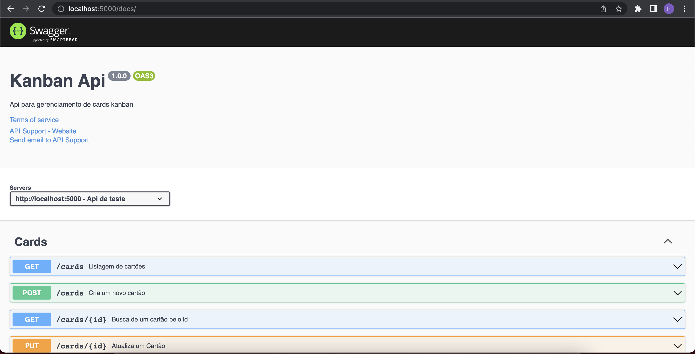
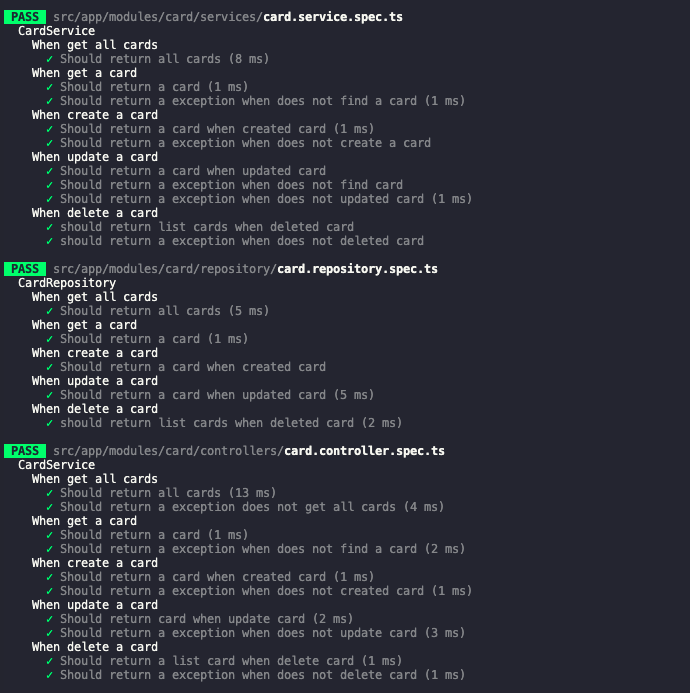

# kanban-api

Api para gerenciamento de board kanban.

## Rodando localmente

Para garantir o ambiente de dev, foi configurado containers com script de entrypoint no host. Assim não é necessario usar comandos `NPM`direto no projeto. Basta subir os containers que já estão configurados para `live-reload`

Na raiz do projeto

```bash
 chmod +x api/.docker/entrypoint.sh
```

Inicie o dock-compose 

```bash
  docker-compose up -d
```
Aguarde o build terminar `(pode demorar umpouco na primeira vez)`

Você pode verificar o status do container com
```bash
  docker-compose ps
```


## Variáveis de Ambiente

Certifique-se de que a variavel `DB_HOST` possua o memso nome do serviço do docker `kanban-db`   .env

`DB_HOST=kanban-db`

secret para gerar token
`SECRET_API`

login `LOGIN=`

senha `PASSWORD=`


## Documentação

[Documentação API](http://localhost:5000/docs)

<p align="center">
  
</p>


## Rodando os testes

Para rodar os testes, rode o seguinte comando

```bash
  npm run test:cov
```

<p align="center">
  
</p>

- obs: foi testado somente as as regras de negocio do dominio `Card`. Faltou tempo para testar middlewares, validators etc..


## Stack utilizada

**Back-end:** Node, Express, inversify, jest, mysql, typeorm, docker


## Obs

foi alterado o campo `senha`para `password` no service do Frontend para seguir o padrão do inglês no backend
 


## Melhorias

- caso o frontend trabalhe com português, refatorar os `DTOs`para que se adeque o contrato
- criar relaciomanto de usuario com card para que somente o usuario edite ou remova seus respectivos cards
 
